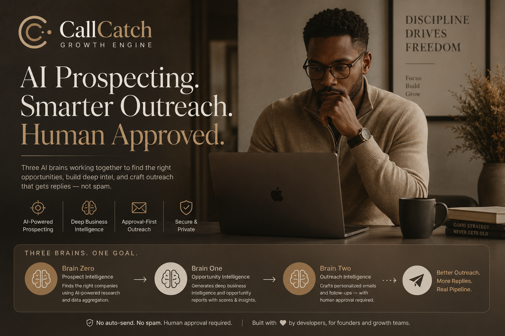
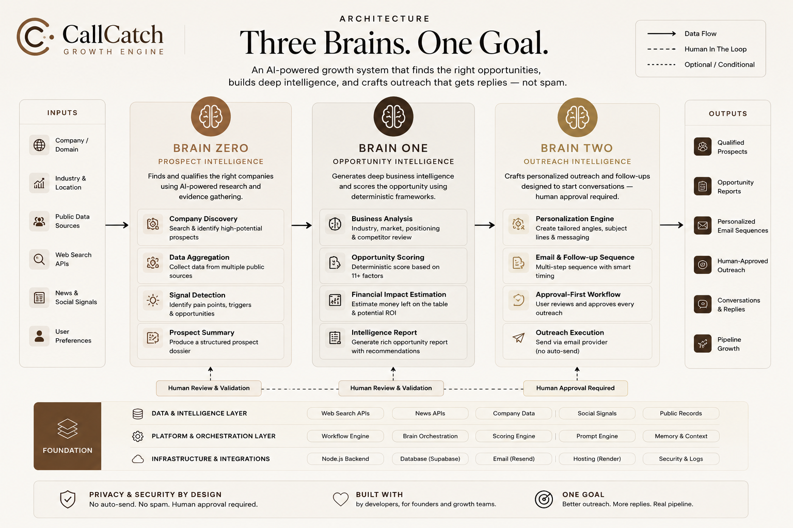

# CallCatch - Multi-Brain AI Prospect Intelligence



**AI prospecting. Deeper intelligence. Human-approved outreach.**

[](https://nodejs.org/)
[](https://developer.mozilla.org/en-US/docs/Web/JavaScript)
[](#how-gpt-56-and-codex-were-used)
[](#how-gpt-56-and-codex-were-used)
[](https://render.com/)
[](https://pages.github.com/)

CallCatch is an AI-assisted prospect intelligence system for outbound growth teams. It researches companies before outreach is created, separates evidence gathering from opportunity analysis, and keeps humans in control of every outreach decision.

The system is organized into three specialized brains: evidence collection, opportunity intelligence, and outreach intelligence. Each layer has its own responsibility, validation rules, and approval boundary.

## Live Links

- Repository: [https://github.com/princeakpabio8-prog/callcatch-growth-engine](https://github.com/princeakpabio8-prog/callcatch-growth-engine)
- Demo: [https://princeakpabio8-prog.github.io/callcatch-growth-engine/](https://princeakpabio8-prog.github.io/callcatch-growth-engine/)

## Key Features

- Evidence-first prospect research using public business information.
- Brain Zero: collects, validates, and structures company evidence.
- Brain One: generates Business DNA, Digital Health, Trust, AI Discoverability, Future Readiness, Hidden Opportunities, Opportunity Radar, estimated money left on the table, and a CONTACT or DO NOT CONTACT decision.
- Brain Two: generates the ideal contact persona, outreach angle, subject lines, personalized first email, three follow-ups, offer recommendation, and outreach confidence.
- Deterministic scoring and evidence references.
- Human approval gates between intelligence and outreach.
- No automatic email sending from the intelligence workflow.
- CRM pipeline with stages, notes, follow-up dates, and activity history.
- Manual company analysis by company name and website.
- Failure-stage diagnostics and regression testing.
- Public frontend demo through GitHub Pages.
- Secure backend integration with environment variables excluded from Git.

## Three-Brain Architecture



| Brain | Input | Output |
| --- | --- | --- |
| Brain Zero - Evidence Collection | Company name, website, and public sources | Structured and validated evidence |
| Brain One - Opportunity Intelligence | Approved Brain Zero evidence | Scores, opportunity report, financial impact, hidden opportunities, and contact decision |
| Brain Two - Outreach Intelligence | Approved Brain One report | Contact persona, outreach strategy, subject lines, email draft, follow-up sequence, and confidence score |

Brain Two never sends emails automatically. It creates outreach intelligence for review, then the existing approval-first sending workflow remains responsible for delivery.

## How GPT-5.6 and Codex Were Used

CallCatch was built during OpenAI Build Week with GPT-5.6 and Codex as collaborative engineering tools.

GPT-5.6 helped design the multi-brain architecture, prompt contracts, scoring boundaries, product decisions, and debugging strategy. It was used to refine how the system separates evidence, intelligence, and outreach rather than treating prospecting as a single generic prompt.

Codex implemented the Node.js services, API endpoints, validation layers, tests, refactors, bug fixes, GitHub Pages setup, and deployment changes. It also helped preserve existing behavior while the architecture evolved.

This was built iteratively. The project was not generated from one prompt; it was shaped through repeated implementation, testing, production debugging, and design tightening.

## Technology Stack

- JavaScript
- Node.js
- Express-style HTTP server using Node's built-in HTTP module
- HTML, CSS, and JavaScript frontend
- GPT-5.6
- Codex
- NVIDIA-hosted model API for Brain One runtime
- Serper and Brave Search API adapters for lead enrichment
- SMTP, Resend, and Brevo email adapters
- Twilio SMS adapter
- Render backend
- GitHub Pages frontend
- GitHub
- REST APIs
- JSON
- Optional Render Postgres through `pg`, with local JSON fallback

## Project Structure

```text
.
|-- index.html                         # GitHub Pages dashboard entry point
|-- callcatch-lead-dashboard.html      # Main dashboard source used locally and on Render
|-- callcatch-lead-server.js           # Node.js backend, API routes, jobs, and orchestration
|-- package.json                       # Start, syntax check, and test scripts
|-- render.yaml                        # Render service configuration
|-- .env.example                       # Environment variable names without secrets
|-- brains/
|   |-- brain-one-runtime.md           # Brain One runtime instructions
|   `-- brain-two-runtime.md           # Brain Two runtime instructions
|-- docs/
|   |-- brain-one-frozen.md            # Frozen Brain One contract
|   `-- images/                        # README visuals
|-- lead-engine/
|   |-- brainZeroService.js            # Evidence collection service
|   |-- brainOneService.js             # Opportunity intelligence service
|   |-- brainTwoService.js             # Outreach intelligence service
|   |-- dataStore.js                   # Local JSON and database storage layer
|   |-- emailAdapter.js                # Resend, Brevo, and SMTP sending adapters
|   |-- sendingEngine.js               # Approval-first sending and follow-up flow
|   |-- websiteScanner.js              # Public website scanner
|   `-- providers/                     # OpenStreetMap, Nominatim, Serper, and Brave adapters
|-- schemas/                           # Strict JSON contracts for Brain outputs
`-- test/                              # Regression and service tests
```

## Local Setup

Clone the repository:

```powershell
git clone https://github.com/princeakpabio8-prog/callcatch-growth-engine.git
cd callcatch-growth-engine
```

Install dependencies:

```powershell
npm install
```

Configure environment variables using `.env.example`. Do not put real secrets in Git. For local email testing, use an ignored local file such as `email-settings.env` or set variables in your shell.

Start the server:

```powershell
npm start
```

The start script runs:

```powershell
node callcatch-lead-server.js
```

Open the local app:

```text
http://127.0.0.1:8787/
```

Useful checks:

```text
http://127.0.0.1:8787/health
http://127.0.0.1:8787/api/network-check
```

## Environment Variables

Variable names are documented in `.env.example`. Real values must be configured locally or in Railway and must never be committed.

Core server and storage:

```text
PORT
HOST
DATABASE_URL
```

Email and SMS:

```text
EMAIL_PROVIDER
RESEND_API_KEY
RESEND_FROM
RESEND_FROM_NAME
RESEND_REPLY_TO
RESEND_WEBHOOK_SECRET
BREVO_API_KEY
SMTP_HOST
SMTP_PORT
SMTP_SECURE
SMTP_USER
SMTP_PASS
SMTP_FROM
SMTP_FROM_NAME
SMTP_REPLY_TO
SMTP_TIMEOUT_MS
SMS_PROVIDER
TWILIO_ACCOUNT_SID
TWILIO_AUTH_TOKEN
TWILIO_FROM_NUMBER
TWILIO_MESSAGING_SERVICE_SID
TWILIO_TIMEOUT_MS
```

Production email should use Resend:

```text
EMAIL_PROVIDER=resend
RESEND_API_KEY=<set in Railway>
RESEND_FROM=hello@callcatch.site
RESEND_FROM_NAME=Prince Akpabio | CallCatch
RESEND_REPLY_TO=<personal Gmail inbox set in Railway>
```

The `callcatch.site` domain must be verified inside Resend before production sending. The `RESEND_FROM` address may be `hello@callcatch.site` even if that private mailbox does not exist, because replies are directed to `RESEND_REPLY_TO`. SMTP variables are not required while `EMAIL_PROVIDER=resend`; Gmail SMTP remains available only as a fallback provider.

Lead enrichment and intelligence:

```text
SERPER_API_KEY
BRAVE_SEARCH_API_KEY
NVIDIA_API_KEY
NVIDIA_MODEL
NVIDIA_API_URL
NVIDIA_TIMEOUT_MS
BRAIN_ONE_MAX_DURATION_MS
BRAIN_ZERO_TOTAL_TIMEOUT_MS
BRAIN_ZERO_PAGE_TIMEOUT_MS
BRAIN_ZERO_CRAWL_TIMEOUT_MS
BRAIN_ZERO_TECHNICAL_TIMEOUT_MS
BRAIN_ZERO_MAX_PAGES
BRAIN_ZERO_MAX_CONCURRENT_REQUESTS
BRAIN_ZERO_CACHE_TTL_MS
BRAIN_ZERO_MAX_ACTIVE_RUNS
BRAIN_ZERO_MAX_RESPONSE_BYTES
BRAIN_ZERO_MAX_REDIRECTS
```

Future adapter placeholders are also listed in `.env.example` for SendGrid, Mailgun, AWS SES, Gmail, Microsoft, Calendly, Slack, HubSpot, and Salesforce.

## Testing

Run the test suite:

```powershell
npm test
```

Run a syntax check for the server:

```powershell
npm run check
```

The current repository test suite covers Brain Zero, Brain One, Brain One handoff reliability, Brain Two, and manual prospect flows.

Latest local verification: 140 passing tests.

## Deployment

Render backend:

- Runtime: Node
- Build command: `npm install`
- Start command: `node callcatch-lead-server.js`
- Environment variables: configure through Render, never Git

GitHub Pages frontend:

- Source: deploy from branch
- Branch: `main`
- Folder: `/root`

The GitHub Pages `index.html` calls the Render backend for API requests.

## Railway Migration

Use this sequence when moving the backend from Render to Railway. Do not delete Render or change the GitHub Pages API endpoint until Railway has been tested privately.

1. Create a Railway project from this GitHub repository.
2. Add a Railway PostgreSQL service.
3. Configure the required Railway environment variables from `.env.example`.
4. Run exactly one application replica during migration.
5. Export the Render PostgreSQL database.
6. Import the backup into Railway PostgreSQL.
7. Start and test the Railway backend before changing GitHub Pages.
8. Verify `/health` reports PostgreSQL storage.
9. Test Gmail SMTP with one harmless test email to your own address only.
10. Update `PRODUCTION_API_BASE` only after every Railway test passes.
11. Monitor Railway and Render separately.
12. Take a final Render backup before retiring Render.

Safe PowerShell backup templates:

```powershell
pg_dump --format=custom --no-owner --no-acl --file callcatch-render-backup.dump $env:RENDER_DATABASE_URL
pg_restore --clean --if-exists --no-owner --no-acl --dbname $env:RAILWAY_DATABASE_URL callcatch-render-backup.dump
```

Warning: Render and Railway must not run scheduled automation against the same production database at the same time. Keep one production writer active while testing the migration.

## Safety and Human Control

- Evidence-based conclusions.
- No invented business claims.
- CONTACT or DO NOT CONTACT decision before outreach.
- Human approval required before outreach moves forward.
- No automatic sending from Brain Two.
- Secrets excluded from source control through `.gitignore`.
- Raw API keys and passwords belong only in local environment variables or Render environment settings.

## What I Am Proud Of

CallCatch is built as a modular intelligence pipeline instead of a one-shot email generator. Brain Zero gathers evidence, Brain One analyzes opportunity, and Brain Two prepares outreach without overwriting the earlier intelligence.

The strongest parts of the build are the deterministic validation rules, evidence references, regression tests, failure diagnostics, and the production deployment path across Render and GitHub Pages.

## What's Next

- Better decision-maker verification.
- Reply intelligence.
- Campaign analytics.
- More industries and countries.
- Improved team collaboration.
- Continued improvements based on real-world testing, not unnecessary prompt rewrites.
